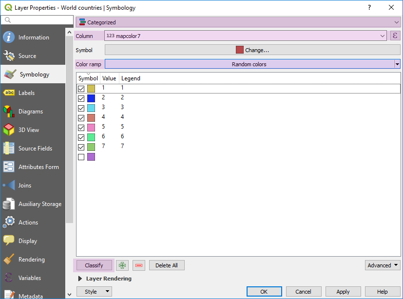
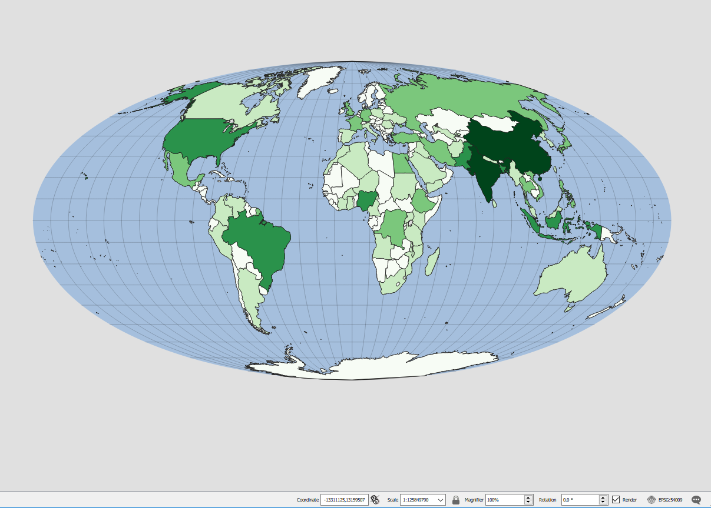

# Lesson 04: Thematic Data Mapping With Table Joins

## Table of Contents

<!-- TOC -->

- [Lesson 04: Thematic Data Mapping With Table Joins](#lesson-04-thematic-data-mapping-with-table-joins)
    - [Table of Contents](#table-of-contents)
    - [Overview](#overview)
    - [Data files](#data-files)
        - [Natural Earth Data](#natural-earth-data)
    - [Exploring Natural Earth data attributes](#exploring-natural-earth-data-attributes)
    - [Thematic map color schemes](#thematic-map-color-schemes)
    - [Projecting the map](#projecting-the-map)
    - [Choropleth map](#choropleth-map)
        - [Standardizing or normalizing our mapped variable](#standardizing-or-normalizing-our-mapped-variable)
    - [Calculating geometry and population density measures](#calculating-geometry-and-population-density-measures)
        - [Field Calculator to calculate area](#field-calculator-to-calculate-area)
        - [Add Geometry Attributes tool](#add-geometry-attributes-tool)
        - [Normalizing by polygon area to create the choropleth map](#normalizing-by-polygon-area-to-create-the-choropleth-map)
    - [Add map to layout and customize legend](#add-map-to-layout-and-customize-legend)
    - [Joining tabular data to Natural Earth geometry data](#joining-tabular-data-to-natural-earth-geometry-data)
        - [Making joins permanent for table edits and calculations](#making-joins-permanent-for-table-edits-and-calculations)
    - [Choropleth map of internet usage](#choropleth-map-of-internet-usage)
    - [Two maps in your Layout](#two-maps-in-your-layout)
        - [Add map to web page](#add-map-to-web-page)
    - [Spatial database option](#spatial-database-option)
        - [Inspect attributes](#inspect-attributes)
        - [Calculating geometry measures](#calculating-geometry-measures)
        - [Calculate population density in one query](#calculate-population-density-in-one-query)
        - [Performing table joins in SQL](#performing-table-joins-in-sql)
        - [Aliasing table names](#aliasing-table-names)
    - [Addendum: Adding custom projections to a spatial database](#addendum-adding-custom-projections-to-a-spatial-database)
    - [Resources and references](#resources-and-references)

<!-- /TOC -->

## Overview

In previous modules we learned how to manage spatial data and create a map in QGIS. In this module, we explore table joins and a common analysis technique using quantitative, numerical data: the choropleth map. We provide two workflows to accomplish the same goal. The first workflow uses QGIS and Field Calculator tools. A second workflow uses PostGIS and SQL.

Throughout this module, we'll be:

- loading CSV data (comma separated values) into QGIS
- reprojecting the map into an equal-area projection
- performing a tabular join and calculating geometry measurements
- creating a classed choropleth map
- adjusting data types and symbology "on the fly"
- creating a layout with multiple maps
- access and process data from live sources


## Data files

- The World Bank's [Internet usage rates by country](https://data.worldbank.org/indicator/it.net.user.zs). Download **internet_users.zip** from Module-04 on Canvas. The zipped archive contains several files, most importantly **internet_users.csv**. It doesn't include geometry; we'll do a tabular join that combines the table with geometry based on a shared attribute for location.
- Download the following Shapefiles from Natural Earth (naturalearthdata.com)
    * [country boundaries](https://www.naturalearthdata.com/http//www.naturalearthdata.com/download/50m/cultural/ne_50m_admin_0_countries_lakes.zip)
    * [ocean](https://www.naturalearthdata.com/http//www.naturalearthdata.com/download/50m/physical/ne_50m_ocean.zip)
    * [10-degree graticule](https://www.naturalearthdata.com/http//www.naturalearthdata.com/download/50m/physical/ne_50m_graticules_10.zip).


### Natural Earth Data

Our goal here is to make a world map of current countries and color them according to a particular quantitative data attribute. Below we will map population density and internet usage for each country. However, We first need to obtain some geometries of world countries with which to make our map.

While there are many sources for these across the web, a great option is always [Natural Earth](http://www.naturalearthdata.com/). Natural Earth offers a variety of generalized layer with attributes for free download and use, which describe both cultural and physical data at one of three scales.

   
_Natural Earth downloads options_

For our purposes here we want to choose "Cultural" data from the "Medium scale data," which has been optimized for 1:50,000,000 scale maps. As we saw in the previous lesson, Kentucky at 1:1,000,000 scale fits comfortably on a map page that's 30" wide and 15" tall. How large of a page would the whole world fit at 1:50 million-scale?

   
_Selecting Cultural Medium scale data_

On the [1:50m Cultural Vectors download page](http://www.naturalearthdata.com/downloads/50m-cultural-vectors/) we are provided a variety of download options, including national administration boundaries, country-level states and provinces, point-level airports and ports, and polygons of urban areas. If you're curious, Natural Earth has packaged all its layers as [SQLite database](http://naciscdn.org/naturalearth/packages/natural_earth_vector.sqlite.zip) and [GeoPackage](http://naciscdn.org/naturalearth/packages/natural_earth_vector.gpkg.zip). The raster data on Natural Earth, while not included in this database, is stunning and should be a primary resource for any continental-scale cartography and it's all free!

For this module, we're going to select "Download countries without boundary lakes" from the "Admin 0 - Countries" option. This option should prompt your web browser to download the shapefiles, bundled together in a zipped file named *ne_50m_admin_0_countries_lakes.zip*.

To make our map look a little more conventional, navigate to the "Physical" features and download the "Ocean" and "Graticule" at 10-degree interval. These layers will help us visualize map distortion later in the lesson while providing more detail for our map.

## Exploring Natural Earth data attributes

Once we have layers in our Layers Panel, let's inspect the attributes. We can see the familiar shapes of our Earthly landmasses, demarcated by nation-state borders. QGIS again automatically applies a random color to these polygons, which you can change in the Layer properties. I changed the white background to a light gray.

   
_Unprojected (EPSG: 4326) Natural Earth layers within QGIS_

Note that the graticule (lines of latitude and longitude) make nice little equally-sized squares all across the map. That's why we call this default projection for unprojected data an [equirectangular projection](https://en.wikipedia.org/wiki/Equirectangular_projection), also known as a "Plate Carreé" projection. If you look at a globe, we know that lines of longitude converge at the poles. The equirectangular projection preserves neither correct shape nor correct area and should never be used other than to quickly view data. We'll explore different projections in the following sections.

The equirectangular projection does have a surprising use in spherical photos as shown in this interactive world map, [https://kuula.co/post/7fBMf](https://kuula.co/post/7fBMf):

   
_An equirectangular projection can make a spherical photo in the VR world_

Let's move onward to more closely inspect these data.

**Right-click** the *ne_50m_admin_0_countries_lakes* layer and select **Open Attribute Layer**. You should now see the table of attributes:

   
_Inspecting attribute table_

**Please note** that your values might be slightly different. We know the world is constantly changing and when Natural Earth updates its data, it might be reflected in that data. Check out Natural Earth's [master change log](https://github.com/nvkelso/natural-earth-vector/blob/master/CHANGELOG) for a detailed discussion of changes.


While some of these data attribute fields may not be immediately evident, we can recognize some of the potential value for us. Obviously, fields such as *sovereignt* and *admin* are the country names.  The *mapcolor7* is an attribute to symbolize countries by seven different colors so that we can more easily see variation. The *gu_a3* column is a three-character code used to uniquely identify countries and is a widely recognized system. We'll use this column to join attributes from the table with internet usage. We also see several other fields that are codes used for individual countries: *sov_a3*, *adm0_a3*, *gu_a3*, *su_a3*, *brk_a3*, *postal*, *iso_a2*, *iso_n3*, etc. 

These are nominal (i.e., categorical) data type attributes. The attributes also include numerous numerical and ordinal data types. For instance, the *pop_est* is an estimation of population count. The *gdp_md_estimate* is the estimate of gross domestic production (GDP), an indicator of wealth. Left-justified fields are text fields and right-justified fields are numeric quantities. Not all numbers are quantities, e.g., zip codes. For further explanation read [Level of Measurement: Nominal, Ordinal, and Numerical Data](http://axismaps.github.io/thematic-cartography/articles/level_of_measurement.html). Understanding the data type is the first step in symbolizing your map features since certain color schemes apply to certain data types.

Sorting fields by quantity or alphabetically is easy. Clicking the field name in the attribute table will sort the table, e.g., you can sort countries by population estimate with the "pop_est" field.


Additionally, there are many other data fields of limited utility to us within this particular mapping process. However, a quick view of the [Natural Earth forum](http://www.naturalearthdata.com/forums/forum/natural-earth-map-data/) can help decipher the field names. Since Shapefiles have a 10-character limit to the name of the field, they often have to be abbreviated. This is a limitation to keep in mind as you continue working with spatial data and one reason we'll be working more with GeoJSON and PostGIS.


## Thematic map color schemes

To symbolize a layer in QGIS, first, right-click on the world countries layer (*ne_50m_admin_0_countrties_lakes*) and choose **Properties**. We'll be using this procedure frequently to perform operations or analysis on data layers within QGIS.

Within the Layer Properties window that opens, select **Symbology** on the left-hand side, and then choose **Categorized**. Then use **Column > _mapcolor7_** dropdown and **Color ramp > Random colors**. If you don't initially see a list of values with associated colors, click the **Classify** button.

   
*Categorical thematic map with a random color scheme to show difference of type.*

This color scheme is called a "_nominal color scheme_". We're coloring our countries to emphasize difference of type. It would not be appropriate to use a _sequential color scheme_ (also called a _graduated color scheme_) with this attribute since it would imply difference of magnitude. A "_diverging color scheme_" is also not appropriate for this data, since the numbers do not indicate a quantity and we have no meaningful statistics on this data. Look at [Axis maps color schemes for thematic maps](http://www.axismaps.com/guide/color_schemes/).

The _mapcolor7_ attribute allows us to symbolize our country polygons so that neighboring countries don't share the same color. What's the minimum number of colors that achieve this result? Take at look at the [four color map theorem](https://en.wikipedia.org/wiki/Four_color_theorem).

   
*Nominal color scheme using the _mapcolor7_ attribute. YES!*

   
*Sequential color scheme using the _mapcolor7_ attribute. NO!*

Let's find an attribute where we can use a graduated color scheme: *pop_est*. 


   
*Sequential color scheme using the *pop_est* attribute. Yes!*

The method of classifying our numeric attributes is the [Natural Breaks (Jenks)](https://en.wikipedia.org/wiki/Jenks_natural_breaks_optimization).

   
*Map of population count using a graduated color scheme*


Note, if you don't see the *pop_est* field, then you might need to apply an expression casting it a real number. Sometimes, Q might read a column as TEXT field when the value is actually numeric.m We can do that 'on-the-fly' with a **Expression** applied to the column in the **Symbology** tab. 

   
*Access Expression dialogue*

   
*Apply an expression that converts a TEXT field to a NUMERIC field*

OK, this map is not great. Why? It's in the default equirectangular projection. Russia looks huge! So big! Let's discover a projection that preserves the proportional area so we can compare countries.

## Projecting the map

Making a map always involves distorting either the area or shape of the landmasses to "project" the roundish Earth on a flat surface (whether that's a printed map or your computer screen). When making a thematic map, it's important to choose a map projection that preserves the area across the map while accepting the distortion of shape.

Within QGIS we can change the coordinate system used to draw the map by changing the  **QGIS menu > Project > Properties... > CRS**. This will change the CRS of the display while maintaining the layers' individual CRS. If want to permanently change the CRS of layer, your would right-click the layer and **Export > Save Features As...** to a new file. The resulting dialog window gives options for specifying a new CRS.

Find **Project > Properties... > CRS**. In the lower panel of the Coordinate Reference System Selector window, we have the option to change either the Geographic Coordinate Systems or the Projected Coordinate Systems.

As we can see, QGIS offers us numerous projections out of the box (you can also define your unique projection), some of these are suitable for mapping geographies at different map scales and purposes (i.e., do we want to preserve the area or shape of our features?). See [Coorindate Reference Systems](https://docs.qgis.org/testing/en/docs/gentle_gis_introduction/coordinate_reference_systems.html) for more guidance on how to choose appropriate projections for your project.

For this map, let's choose the Equal-Area Mollweide Projection. Note that it is sometimes easiest to search for a given projection within QGIS using the [EPSG code](http://www.epsg.org/) (in this case EPSG: 54009).

   
*Selecting equal area projection*

Once the map is projected into the EPSG: 54009 CRS, we can compare the result with the "unprojected" equirectangular map (above).

   
*World map projected as equal-area cylindrical projection*

We can see that now the area of the landmasses is preserved, e.g., Greenland does not appear larger than Africa. The shapes of land masses are distorted, e.g., Greenland looks kinda 'funny'.

There are other equal-area projections you may find suitable for world maps. Among these are the World Eckert VI (EPSG:54010) displayed here. Note how the inclusion of a graticule, also downloadable from Natural Earth, helps one see the angles by which the map is being distorted.

   
*GDP per capita map projected as equal area World Eckert VI, EPSG:54010*

The World Bonne projection, EPSG:54024, is another good choice and makes the land masses appear a bit more "natural" in their shape, though some audiences may find it difficult to concentrate on the information being displayed because of the uniqueness of the shape of the projected Earth:

   
*GDP per capita map projected as equal area World Bone, EPSG:54024*

If you find that a projection causes your geometry to look broken or fractured, you will need to create a new layer. Transform the layer to the new CRS using the right-click on the layer and **Save As..**  to new data.


## Choropleth map

Perhaps the most common type of thematic map is the choropleth, which we just made. These maps use enumeration units (a fancy term for polygons) such as states or counties to show the distribution of a particular phenomenon across the units. Choropleth maps have become the archetypal thematic map, particularly online. As the public has become accustomed to reading them (especially regarding "election maps"), mappers can assume these maps will be well understood (or, unfortunately, easily misunderstood). As a bonus, choropleths are relatively easy to make with desktop GIS programs like QGIS and web mapping libraries such as Leaflet, Mapbox and CARTO.

Choropleths are ideally used to map continuous areal (or area-based) phenomena and represent a statistical surface for enumeration units. However, as mappers, we often violate this principle. For example, it's common to use choropleth maps to symbolize population, even though the majority of people now live in dense cities. Choropleth maps also depict the data as if it changes abruptly at the borders of the enumeration unit. While this makes complete sense for something like county-level tax rates, the symbolization technique becomes problematic when applied to continuous phenomena, like the average elevation of a county.

### Standardizing or normalizing our mapped variable

At the most basic, a choropleth map symbology applies a sequential color scheme to symbolize the quantity of the desired variable for each enumeration unit on the map. How much of X is in Y? The goal of the choropleth, however, is to allow comparisons between different units. We should recognize that mapping raw counts present a problem; larger enumeration units can contain larger quantities of anything mappable. Raw counts or totals must be divided by another value (such as area) to create a rate, ratio, or density measure. This method is known as standardizing or normalizing the data, and it allows for the comparison of units of varying sizes.

This raw count vs. density measure is a bit of conundrum for a new mapper. Our first instinct is to map the raw count and it can make a useful map, depending on the variable. For example, it's nice to know the total population of a county. A more interesting map would be to show the density of that population (people per square mile), since that reflects a better sense of how people live in that county. Read more about [Choropleth Maps](http://axismaps.github.io/thematic-cartography/articles/choropleth.html).

Let's walk through the process of making a choropleth map using the data provided by Natural Earth (we intentionally saved the GDP and population estimates for this purpose). After that, we can repeat the process with data we wish to join to these country polygons to create our intended choropleth map of global Internet access.

OK, time to explore how we can make choropleth maps that normalize raw count variables, like population density.

## Calculating geometry and population density measures

Let's take a look at the *pop_est* variable for each country and divide by the polygon area of each country. This measure would give population density. When we inspect the attributes, we find no column for area, so we'll need to calculate that geometry measurement.

The first step in any choropleth mapping exercise is deciding which coordinate system to use and then modify our **Project > Properties... > CRS** to that coordinate system. We have found that the World Mollweide EPSG: 54009 is a good global equal-area CRS. Verify that the lower-righthand corner in QGIS says "EPSG: 54009" which means that the data is being projected on-the-fly to EPSG: 54009.

### Field Calculator to calculate area

We can project our data to a cartesian plane (we are using World Mollweide EPSG: 54009), save to a new layer, and make geometry measurements on that layer. Instead, let's measure area directly on Earth's surface, or an approximate model of the sphere-like shape of Earth, the ellipsoid. QGIS now sets an ellipsoid by default so we can reliably measure geometry with this method.

In the QGIS menu, open **Project > Project Properties > General** and verify your measurement units. WGS 84 is the default ellipsoid and is the CRS of our Natural Earth data. If our data used a different ellipsoid (e.g., NAD 83) we would need to change that here. 

   
*Verify measurement units in Project Properties*


   
*Open Field Calculator*

Our area unit are square meters (it can be changed to other units). In the Field Calculator (it is the menu button symbolized with an abacus ) we can create a column called, "area_sqkm" and calculate square kilometers, a simple unit conversion of dividing by a million (a million square meters in a square kilometer):

   
*Calculating area in the Field Calculator on the ellipsoid*

and using the expression:

```
$area / 1000000
```
After the calculation open the layer's attribute table and verify that you have output. When we perform table calculations, the layer enters edit mode. We can toggle editing off and save our calculations by clicking the **Pencil** icon:

   
*Saving our edits by toggle off edit mode*

### Add Geometry Attributes tool

We can also use a vector geoprocessing tool calculate geometry measures. Find the tool in the QGIS menu **Vector > Geometry Tools > Add Geometry Attributes...**:

   
*Adding geometry columns using the WGS 84 ellipsoid*

This geoprocessing tool will reliably add geometry measurements and create a new temporary layer by default. You can always **Export > Save Features As...** to a new layer once the analysis is done. Your tool should look like:

   
*Adding geometry columns using the WGS 84 ellipsoid*

The output columns are in the unit of the CRS, meter. If we use this tool, we will still need to use Field Calculator to convert to square kilometers.

This method of geometry calculation is fine, but you can do this without creating new layers or data. For a more robust approach to calculating geometry measurements explore the PostGIS option at the end of the lesson.

### Normalizing by polygon area to create the choropleth map

We now have a spatial layer with population as a raw count and a field with a measurement of area by country. Let's use our **Properties... > Symbology** tab to create a custom expression for **Graduated** symbology:

```
"pop_est" / "area_sqkm"
```

If your variables are not shown in the **Graduated** dropdown menu, you'll need to cast them to numbers. If QGIS doesn't recognize the fields as numeric, use the **Expression dialog** like we did earlier to convert our TEXT fields to NUMERIC field types.  Then, use the division symbol ```/``` to divide population count by area:

```
to_real(  "pop_est"  )  /  to_real(  "area_sqkm" )
```

This is calculated "on the fly" just like our coordinate system. Your **Symbology** panel should look like:

   
*Style panel for creating population density measure*

We used the "Quantile (Equal Count)" ([nice video explanation from Benjamin Meader](https://www.youtube.com/watch?v=0ebL8OvG8Jc)) classification mode. Because the population density is highly skewed, using Natural Breaks would have most countries in the lowest classes. The Equal Count puts an equal number of countries in each class. Setting classification mode is an exploratory process. However, once you get a distribution that looks detailed, we can clean up the legend and make a finished map.

   
*People per square kilometer by country*

## Add map to layout and customize legend

The inclusion of a legend is important for the reader to interpret the symbology of a choropleth map. However while QGIS's internal algorithms for applying various methods of class breaks to a dataset are extremely helpful, they may produce class breaks within the data that are difficult for a map reader to make sense of. A way to deal with this is to manually adjust the actual values of the class breaks to be more rounded numbers. It may not seem very scientific to take the values that QGIS painfully produced through precise algorithms and just round them to other numbers as we see fit. Trust us, this is a perfectly acceptable cartographic practice. We've already seen how changing the mode of classification dramatically remakes the map. There are few hard and fast rules when it comes to these questions. Use your power as a cartographer thoughtfully, since you can significantly influence the interpretation of this map.

To alter your class breaks, just double-click the **Values** in your **Symbology** tab classification values. You'll need to also edit the corresponding **Legend** values:

   
*Editing classification breaks*

Let's take moment to discuss field "precision" in the context of the **Style** tab and legend. A numeric field's "precision" is the number of decimal places here. If you applied a negative precision, you are rounding to the number.

   
*When you finish your style and legend, save the style as a QGIS Layer Style file or in a database*

When you have a map you like, create a new **Layout**, say 12" wide by 18" tall page size, and add this map and legend. You might just create:

    
*Creating a finished map in Layout*

In the **Map 1 > Item Properties** tab, check on **Lock layers** and **Lock styles for layers**. This creates a snapshot of our Map Canvas. Now we can alter layers in our **Layers Panel** to create additional maps to place in Print Composer.

We just walked through a foundational process for creating a choropleth map using QGIS. Before moving on to this week's lab challenge, let's bring in some tabular internet access data and join them to these country geometries.

## Joining tabular data to Natural Earth geometry data

We've acquired data from the World Bank about world Internet access and will make a choropleth map allowing a user to compare these rates. We can either keep the existing QGIS project file open to use in this next section, or we can save the current project and then save a new project (world internet access by country). Since we went through all the trouble of cleaning up the attribute table, we may as well just reuse this project instead of downloading new data.

First, let's take note of our data. Our downloaded CSV is plain text file (comma separated values) with the name *internet_users.csv*. Open the metadata file to understand your data. 

If we open this file within a code editor, we can quickly see this is a little dizzying. We recommend using the [OpenOffice Calc application](https://www.openoffice.org/product/calc.html) for editing CSV files although Excel will work as well. We can edit with a code editor, but it would take some clever find/replace and select techniques.

Upon inspecting the data encoded within this file, the important things we want to take note of are:


* The first row contains the column names and every row there after is a record or feature
* The column of Country Name (which we may wish to use later for labeling countries)
* the column of Country Code (very important! which we'll use to match with our Natural Earth Shapefile geometries)
* the data columns for each year, the values of which we note appear to be already encoded as a percentage (therefore we won't need to standardize against a population or some other value)
* Read the supplied metadata for more detail


Also notice the _.csvt_ file (e.g., named *internet_users.csvt* ) that defines the field data type for each field. This _.csvt_ file must be a text file with only one line and defines the types for each column. They should be quoted and comma separated, e.g. "Integer","Real","String" for INTEGER, NUMERIC, and TEXT data type, respectively. The sequence should match the _.csv_ field list.

Our goal to join this CSV data to our country layer geometries using the shared Country Code values. In GIS this is called performing a table or attribute join.

First, let's load the *internet_users.csv* via the QGIS menu **Layer > Add Layer > Add Delimited Text Layer...**:

   
*Add Delimited Text Layer*

with the following option selected **No Geometry**:

   
*Delimited text layer import options*

Our world country spatial layer and internet CSV table share a common field; they both have a country code in the same three-digit format, *gu_a3* and *Country_code*, respectively. Access the properties of world country spatial layer and select the **Joins** panel. Select the join table and attributes to create the join:

   
*Attribute join in the layer properties dialog*

Verify that you have a join in the attribute table. If all looks good, you can now map internet usage by country.


### Making joins permanent for table edits and calculations

Joins are not permanent by default and are mainly used for symbolizing features. If you try to edit a joined table, e.g., creating a new field for area calculations, you will likely break the join. The easiest way to make the join permanent is to save the join layers to a new layer. Right-click the layer and **Export > Save Feature As...** to a new GeoJSON.


## Choropleth map of internet usage

After you have a verified a successful join, add the layer to our **Map Canvas** and start styling it! Here's a styled layer:

    
*Internet use by country in 2017*

Notice the `%` symbols in the **Legend Format** settings in the layer's **Style** tab. To the right it adds a percent sign. To the left, it denotes which how to display the class breaks in the legend with `%1` being the lower class break value and `%2` the upper class break value.

    
*Styling the internet use by country in 2017 layer*

OK, let's finish our map by adding the new map in **Layout**.

## Two maps in your Layout

To finish our exercise, we need to add this new map and legend to our layout. Since we have locked the styles for the previous **Map Canvas** map showing population density, let's add this new map and repeat the process:

   
*Adding a second map to our layout*

This second map is called "Map 2" has a unique set of **Item Properties**. If we want our maps to look the same, we'll need to ensure their scale match. In the lab, you'll add multiple maps to a page and will adjust the scale and rotation to make additional maps look good on the page.

Now let's finish up our map with title and metadata to complete our lesson. Since we're displaying a world map, scale bars and north arrows aren't necessary. In fact, a scale bar would be misleading since the earth is certainly not that much shorter between the poles than at the Equator.

An example of a finished map:

    
*Patterns of Population Density and Internet Use in 2014*

### Add map to web page

As in the previous lesson, let's create a web page to serve this map. Start with the *index.html* template in the repo folder *lesson-map*. Modify the HTML body near `<!-- Add your custom HTML here -->` to reflect your PNG file name:

```html
<!-- This is an HTML comment. Find the comments below and follow the instructions. -->

		<h1>World map of ...</h1><!-- What's a good title? -->

		<div id='map'>
			<!-- custom CSS here -->
			<br> <!-- line break tag -->
			<a href="../graphics/Patterns_Pop_Density_Internet_Use_in_2014_8000px.png">Link to high resolution map</a>
		</div>
```

Notice the double period `..` in the relative path for the image? That instructs the browser to look for the resource in folder above the *index.html*. Depending on where you save your PNG file, this path will be different.

Let's add a custom CSS rule by replacing the comment `/* add custom style class here */` in the `<style></style>` tag with the class definition below:

```css
.max-image-width {
			width:100%;
		}
```

Start Atom's **atom-live-server** to preview your web page:

   
Figure 44: Map in a web Page

Add basic metadata to web page to help viewers understand your project. Commit your changes often and when complete, push to your remote repository.

## Spatial database option

If you are working in a spatial database, let's create a new schema and add the downloaded data. Create a new QGIS project inside the repo _lesson-map_ folder. In QGIS's **Browser Panel** right-click on the **PostGIS** to connect your database (if isn't connected already).

In PostGIS you can create a new schema with DB Manager. A schema can be thought of as a separate workspace or folder within your database where spatial assets are stored. While you can use your _public_ schema for your projects, a separate schema is good to organize your data:


_Create new schema in DB Manager_

If your new schema is named "module_04", then the syntax for calling a table outside the _public_ schema is to prefix the table name with the schema name separated by a period:

```sql
select
	*
from
	module_04.table_name -- dot notation to access tables in different schemas
```

Using DB Manager, add the Natural Earth layers to your newly created database. Make sure you follow the steps we used in the previous lesson. Properly building a database is the key to start a GIS project. After import, you should have a database layers similar to:

   
*Natural Earth layers in the module_04 schema within the PostGIS database, qgis_db*

### Inspect attributes

Let's use DB Manager to explore some of the attribute data of our *ne_50m_admin_0_countries* layer. The examples below are written as if the tables are in the "module_04" schema. If you added the Natural Earth Data you downloaded to the "public" schema, you do not need to prefix the table name with the name of the schema.

Open a **SQL window** in the DM Manager and **Execute** the following query:

```sql
/* Let's first view our features */

select
    *
from
    module_04.ne_50m_admin_0_countries_lakes

```

OK, let's select only those we need for our work:

```sql
/* View only useful columns */

select
    id, 
    geom, 
    name, 
    mapcolor7, 
    pop_est, 
    gdp_md_est, 
    gu_a3
from
    module_04.ne_50m_admin_0_countries_lakes

```
We should be familiar with the *id*, *geom*, and *name* fields. The *mapcolor7* is an attribute to symbolize countries by seven different colors so that we can more easily see variation. The *pop_est* is an estimation of population count. The *gdp_md_estimate* is the estimate of gross domestic production (GDP), an indicator of wealth. The *gu_a3* column is a three-character code used to uniquely identify countries and is a widely recognized system. We'll use this column to join attributes from the table with internet usage.

Which country is has the largest population and highest GDP? Let's sort with SQL:

```sql
/* Rank by largest population */

select
    id, 
    geom, 
    name, 
    mapcolor7, 
    pop_est, 
    gdp_md_est, 
    gu_a3
from
    module_04.ne_50m_admin_0_countries_lakes
order by
    pop_est desc --specify the sort field here

```

and

```sql
/* Rank by highest GDP */

select
    id, 
    geom, 
    name, 
    mapcolor7, 
    pop_est, 
    gdp_md_est, 
    gu_a3
from
    ne_50m_admin_0_countries_lakes
order by
    module_04.gdp_md_est desc --specify the sort field here

```


### Calculating geometry measures

Open DB Manager and execute the query we used earlier to sort by population:

```sql
/* Rank by largest population */

select
    id, 
    geom, 
    name, 
    mapcolor7, 
    pop_est, 
    gdp_md_est, 
    gu_a3
from
    module_04.ne_50m_admin_0_countries_lakes
order by
    pop_est desc; --specify the sort field here

```
How can add a geometry measurement to our table? We can use PostGIS's ```st_area(geom)```  function to calculate area, where _geom_ is the field that contains geometry. When we use this function, we need always to be aware of the coordinate system units of our layer, which, in this case, are angular units, i.e., degrees.

```sql
/* Rank by largest area in units of degrees??? */

select
    id, geom, name, mapcolor7, pop_est, gdp_md_est, gu_a3,
    st_area(geom) as area_unknown_units
from
    module_04.ne_50m_admin_0_countries_lakes
order by
    area_unknown_units
    desc; --specify the sort field here

```
Look at the output table and find the column *area_unknown_units*. Why are the values so small?

   
*Area calculated in ESPG: 4326*

The ```st_area(geom)``` function calculates the area in 2D (Cartesian coordinate system) regardless of units. Since the units are in EPSG: 4326 are decimal degrees, which have dimensions between 360 in width and 180 in height, the output is also small. A 2D area calculation with these dimensions result in an earth area of 64,800 units. Unfortunately, this is a meaningless measurement. If we wanted to inspect our coordinate values, we can use the ```st_asText(geom)``` function to display them as a text field. For example, execute this SQL in DB Manager and expend the columns to read the contents:

```sql
/* View coordinate values in geom field */

select
    st_asText(geom) as "Coordinates",
    name
from
    module_04.ne_50m_admin_0_countries_lakes;

```

    
*Use `st_astext(geom)` to read coordinate values in _geom_ field*

PostGIS will calculate [area on a spheroid with units](https://postgis.net/docs/ST_Area.html) in square meters if pass an argument telling the function to calculate area on spheroid or a perfect sphere (much faster to calculate):

```sql
/* Calculate area in different units in geom field */

select
  name,
    st_area(geom) as "decimal degrees",
    st_area(geom, true) as "sq meters on spheroid",
    st_area(geom, false) as "sq meters on perfect sphere",
from
    module_04.ne_50m_admin_0_countries_lakes;

```

 Which method to use? Let's experiment. We'll project our layer to an equal-area CRS (EPSG: 3975) before calculating area measurements. We can use the ```st_transform()``` function to project our layer. We only need to know the field name that contains the geometry, i.e., the _geom_ field, and the SRID of the target coordinate system. Let's practice some SQL queries to show how the ```st_transform()``` works.

```sql
/* Transform geometry field to EPSG: 3975 */

select
    st_transform(geom, 3975) as equal_area_geom,
    st_asText(geom) as "Coordinates",
    name
from
    module_04.ne_50m_admin_0_countries_lakes;

```

We can reveal the contents of the *equal_area_geom* field by nesting functions in SQL:

```sql
/* Transform geometry field to EPSG: 3975 and display contents as text */

select
    st_asText(st_transform(geom, 3975)) as "Coordinates in EPSG: 3975",
    st_asText(geom) as "Coordinates in EPSG: 4326",
    name
from
    module_04.ne_50m_admin_0_countries_lakes;

```
Look at the resulting columns:

   
*Nesting functions to show two different coordinate systems*

If we observe the nesting function capability, it should be easy to see that we could transform and calculate area in the same step. We'll compare it with measuring area on the spheroid and see how close they are.

```sql
/* Rank by largest area in units of square kilometers */

select
    id, geom, name, mapcolor7, pop_est, gdp_md_est, gu_a3,
    st_area(st_transform(geom, 3975))/1000000 as "sq km on plane",
    st_area(geom, true)/1000000 as "sq km on spheroid",
    st_area(geom, true)/st_area(st_transform(geom, 3975)) as "comparison"

/* Note that the linear unit of measure in EPSG: 3975 and default PostGIS is the meter. To convert sq m to sq km, we need to divide by 1,000,000 */

/* The "comparison" field will show us the ratio of difference between the two area calculaitons to help us decide which is method to use. */

from
    module_04.ne_50m_admin_0_countries_lakes
order by
    "sq km on spheroid"
desc;
```
Your successful query should look like:

   
*Comparing area measures on a spheroid and an equal-area projection*

As we can see, using the PostGIS `st_area(geom, true)` function with the `true` argument to measure on the spheroid is a good method. We could use a projected CRS for measuring geometry, but it adds more steps.

**Please note** if you Google the areas of countries in square kilometers, you'll discover that these values are close but not exact. Why is that? Primarily, the shapes of the earth's landmasses are encoded at 1:50,000,000-scale resolution. The shape is imprecise so the measured area will also be imprecise.


### Calculate population density in one query

OK, let's use what we've learned in prior modules to calculate area and population density in one query:

```sql
/* Create population desnity of world countries. */

/* Delete table if exists */
drop table if exists
	module_04.world_countries_pop_density_est;

/* Create new table that ranked by population density. */
create table
    module_04.world_countries_pop_density_est
as
select
    id, 
    geom, 
    name, 
    mapcolor7, 
    pop_est, 
    gdp_md_est, 
    gu_a3,
    st_area(geom, true)/1000000 as area_in_sq_km,
    pop_est/(st_area(geom, true)/1000000) as pop_per_sq_km -- default unit is meter, to convert sq m to sq km, we need to divide by 1,000,000
from
    module_04.ne_50m_admin_0_countries_lakes
order by
    pop_per_sq_km desc;

/* Add primary key */
alter table
	module_04.world_countries_pop_density_est
add primary key (id);
```

Add your layer to Map Canvas and classify and symbolize your layer using the **Graduated** method:

   
*Classifying and symbolizing population density*

### Performing table joins in SQL

Let's first import the text file into our spatial database using the **Import** dialog in DB Manager:

   
*Use CSV file from the previous import*

We don't need to **Convert field names to lowercase** because the field names contain spaces; they will need to be wrapped in double quotes anyway. 

Our country spatial layer and internet use CSV table share a common field; they both have a country code in the same three-digit format. We'll join these two tables using this common field or key. We have two main types of joins in  SQL that we'll use:

* An inner (aka natural) join only includes matching records.


* A left join includes all of the records from the spatial layer and those matching from the join table.


The column names and tables we'll use are:

* "County Code" in _internet_users_
* "adm0_a3" in *ne_50m_admin_0_countries_lakes*

An example in SQL would help. This is called a _Natural_ or inner join:


```sql
/* Join tables where records share the same attribute */

select 
    *
from
    module_04.ne_50m_admin_0_countries_lakes,
join
    module_04.internet_users
on
    module_04.internet_users."Country Code" = module_04.ne_50m_admin_0_countries_lakes.adm0_a3
```

Where records in both tables share the same value in these columns, their attributes are joined. 211 joins were produced in the output table. We can also write the (inner) join as 

```sql
/* Join tables where records share the same attribute */

select 
    *
from
    module_04.ne_50m_admin_0_countries_lakes,
    module_04.internet_users
where
    module_04.internet_users."Country Code" = module_04.ne_50m_admin_0_countries_lakes.adm0_a3
```

Let's do an outer join:

```sql
/* Join tables where all records are output from the left-hand table
and only the matching records from the right-hand table */

select
    *
from
    module_04.ne_50m_admin_0_countries_lakes     
    --this is the left-hand table
left join
    module_04.internet_users                     
    --this is the right-hand table
on
    module_04.internet_users."Country Code" = module_04.ne_50m_admin_0_countries_lakes.adm0_a3

```
All records from the spatial layer, the first table listed is the left-hand table, are included in the join. Matching records in the right-hand table are included. We have 241 records output. That means 28 country codes don't match. Political geography is a volatile field of practice!

Let's create a layer for mapping Internet access for the year 2017 with the following SQL query:

```sql
drop table if exists
	module_04.orld_countries_internet_usage;

/* Internet usage for 2017 by country per 100 people ranked highest to lowest */

create table
    module_04.world_countries_internet_usage
as
select
    module_04.internet_users."2014",
    module_04.ne_50m_admin_0_countries_lakes."adm0_a3",
    module_04.ne_50m_admin_0_countries_lakes."geom",
    module_04.ne_50m_admin_0_countries_lakes."id",
    module_04.ne_50m_admin_0_countries_lakes."name",
    module_04.ne_50m_admin_0_countries_lakes."pop_est",
    (module_04.ne_50m_admin_0_countries_lakes."pop_est")/(st_area(module_04.ne_50m_admin_0_countries_lakes."geom",true)/1000000) as pop_per_sq_km,
    module_04.ne_50m_admin_0_countries_lakes."gdp_md_est"
from
    module_04.ne_50m_admin_0_countries_lakes     
    --this is the left-hand table
left join
    module_04.internet_users                     
    --this is the right-hand table
on
    module_04.internet_users."Country Code" = module_04.ne_50m_admin_0_countries_lakes."adm0_a3"
order by
    internet_users."2017" DESC;

/* Add primary key */

alter table
	module_04.world_countries_internet_usage
add primary key (id);
```


### Aliasing table names

Sometimes writing SQL queries gets verbose. We can substitute long table names (including schemas) with aliases. When you call the table name in the `from` or `join` clauses use the `as` keyword and specify a shorter name. The above could be written as:

```sql
/* Delete table if exists */

drop table if exists
	module_04.world_countries_internet_usage;

/* Internet usage for 2017 by country per 100 people ranked highest to lowest */

create table
    module_04.world_countries_internet_usage
as
select
    b."2017",
    a."adm0_a3",
    a."geom",
    a."id",
    a."name",
    a."pop_est",
    (a."pop_est")/(st_area(a."geom",true)/1000000) as pop_per_sq_km,
    a."gdp_md_est"
from
    module_04.ne_50m_admin_0_countries_lakes as a 
    -- substitute table location and name with "a"   
left join
    module_04.internet_users as b    
    -- substitute table location and name with "b"          
on
    b."Country Code" = a."adm0_a3"
order by
    b."2017" DESC;

/* Add primary key */

alter table
	module_04.world_countries_internet_usage
add primary key (id);

```


## Addendum: Adding custom projections to a spatial database

In the previous sections, we used the Equal-Area Mollweide Projection, [EPSG: 54009](http://www.epsg.io/54009). Unfortunately, this SRID might not be included in your database spatial reference system. We can easily add new projections to our spatial database by using the ```Insert``` statement found at [http://www.epsg.org/54009](http://www.epsg.io/54009). If you copy the SQL definition text for PostGIS in the Export section, you can paste it into your query window and execute:

   
Figure 27: Copy SQL definition(PostGIS) at epsg.io/54009 and paste it into your query window

The copied SQL gives us:

```sql
INSERT into spatial_ref_sys
    (srid, auth_name, auth_srid, proj4text, srtext)
values
    ( 54009, 'ESRI', 54009, '+proj=moll +lon_0=0 +x_0=0 +y_0=0 +datum=WGS84 +units=m +no_defs ', 'PROJCS["World_Mollweide",GEOGCS["GCS_WGS_1984",DATUM["WGS_1984",SPHEROID["WGS_1984",6378137,298.257223563]],PRIMEM["Greenwich",0],UNIT["Degree",0.017453292519943295]],PROJECTION["Mollweide"],PARAMETER["False_Easting",0],PARAMETER["False_Northing",0],PARAMETER["Central_Meridian",0],UNIT["Meter",1],AUTHORITY["EPSG","54009"]]');

```
Which will look like this in DB Manager:

   
Figure 28: Executing this SQL query will insert a new record in our spatial reference table, though nothing will be returned in the SQL window

If you want to add an equal-area CRS for North America, check out EPSG: 102008

```sql
--- Add EPSG: 102008 CRS to your database ---
---- Copy, paste, and execute. That's it! ---
INSERT into
    spatial_ref_sys (srid, auth_name, auth_srid, proj4text, srtext)
values
    ( 102008, 'ESRI', 102008, '+proj=aea +lat_1=20 +lat_2=60 +lat_0=40 +lon_0=-96 +x_0=0 +y_0=0 +datum=NAD83 +units=m +no_defs ', 'PROJCS["North_America_Albers_Equal_Area_Conic",GEOGCS["GCS_North_American_1983",DATUM["North_American_Datum_1983",SPHEROID["GRS_1980",6378137,298.257222101]],PRIMEM["Greenwich",0],UNIT["Degree",0.017453292519943295]],PROJECTION["Albers_Conic_Equal_Area"],PARAMETER["False_Easting",0],PARAMETER["False_Northing",0],PARAMETER["longitude_of_center",-96],PARAMETER["Standard_Parallel_1",20],PARAMETER["Standard_Parallel_2",60],PARAMETER["latitude_of_center",40],UNIT["Meter",1],AUTHORITY["EPSG","102008"]]');
```

Note that you can only insert these records once, because we can't have duplicate SRIDs. Nothing is harmed if you try to add duplicate records. If you changed the SRID to the large value to make it unique, you could create your own projections.


## Resources and references

* [Natural Earth](http://www.naturalearthdata.com/)
* [Level of Measurement: Nominal, Ordinal, and Numerical Data](http://axismaps.github.io/thematic-cartography/articles/level_of_measurement.html)
* [Choropleth Maps](http://axismaps.github.io/thematic-cartography/articles/choropleth.html)
* [The World Bank Group: Internet Users](http://data.worldbank.org/indicator/IT.NET.USER.P2)
